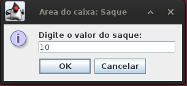
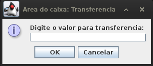

# Desafio DIO - Banco digital

Desafio de codigo proposto no bootcamp DIO - Quebec, onde o objetivo é fazer um simulador basico de um banco digital.

---
Minha base foi criar uma interface para acesso à três areas:

- Gerente:
    
    É aquele que pode cadastrar novos clientes e caixas, e ele tem a relação de todos os clientes. 
    
    Ele consegue acessar essa interface usando a "Area administrativa".

- Caixa:

    É aquele que pode fazer as operações bancarias, como: deposito, saque e transferencias.

    Ele consegue acessar essa interface usando o "Espaço dos funcionarios".

- Cliente:

    O cliente do banco, ele pode acessar o seu próprio saldo, e suas informações.

    Ele consegue acessar essa interface usando o "Espaço do cliente".

    

---

## Gerente:

Abrindo pela primeira vez, não será possivel acessar o "Espaço do cliente" e nem o "Espaço dos funcionarios", pois não tem nenhum cliente nem funcionario cadastrado.

Sendo assim, ao acessar a "Area administrativa", como não existe também nenhum gerente cadastrado, será pedido para cadastrar um gerente.

 

E com isso, assim da confirmação dos dados, será mandado de volta ao menu principal, onde pode voltar a "Area administrativa", onde será pedido a matricula do gerente.

O numero da matricula é atribuido conforme for adicionando os funcionarios, logo, como esse é o primeiro funcionario, a matricula será "0". E com isso, será possivel acessar os menus do gerente.

Aqui como dito anteriormente é possivel fazer o cadastro de cliente, de caixa, de outros gerentes e a relação de clientes cadastrados.

- Cadastro do cliente:

    
    
    

- Cadastro de caixa:

    
    

- Ver clientes cadastrados:

    

---

## Caixa

Depois de cadastrar o primerio caixa, se torna possivel acessar a area do caixa, onde vai ser perguntado a matricula antes do acesso.

E logo que for indicado a matricula, imediatamente depois vai perguntar qual cliente quer ser atendido.

E com isso, se o numero do cliente existir, ele irá para o menu do caixa, indicando quais operações gostaria de fazer com o cliente selecionado.

- Deposito

    
    

- Sacar

    
    

- Transfererir

    
    
    

---

## Cliente

Agora que o cliente foi cadastrado, é possivel acessar a area do cliente, informando o numero da conta dele assim que for acessado.

E como foi dito anteriormente, o cliente pode fazer duas operações, "Ver saldo" e "Informações da conta".

- Ver saldo:

    

- Informações da conta:

    

---

## Problemas a serem corrigidos:

Boa parte das exceções de codigo foi corrigida, mas ainda existe algumas ~~como por exemplo: Se durante qualquer um dos cadastros for deixado um espaço em branco, o programa irá crashar, e se estiver sendo executado numa IDE, será retornado um `NumberFormatException`.~~

Em algumas partes do programa, o `cancelar` ou o `não` não ira retornar ao menu anterior, porém nenhum deles ficará em loop.

O programa não exporta os dados AINDA, então toda vez que fechar, será necessario fazer os cadastros novamente (Como esse codigo foi um aprendizado, persistencia de dados foi ignorado no primeiro momento).